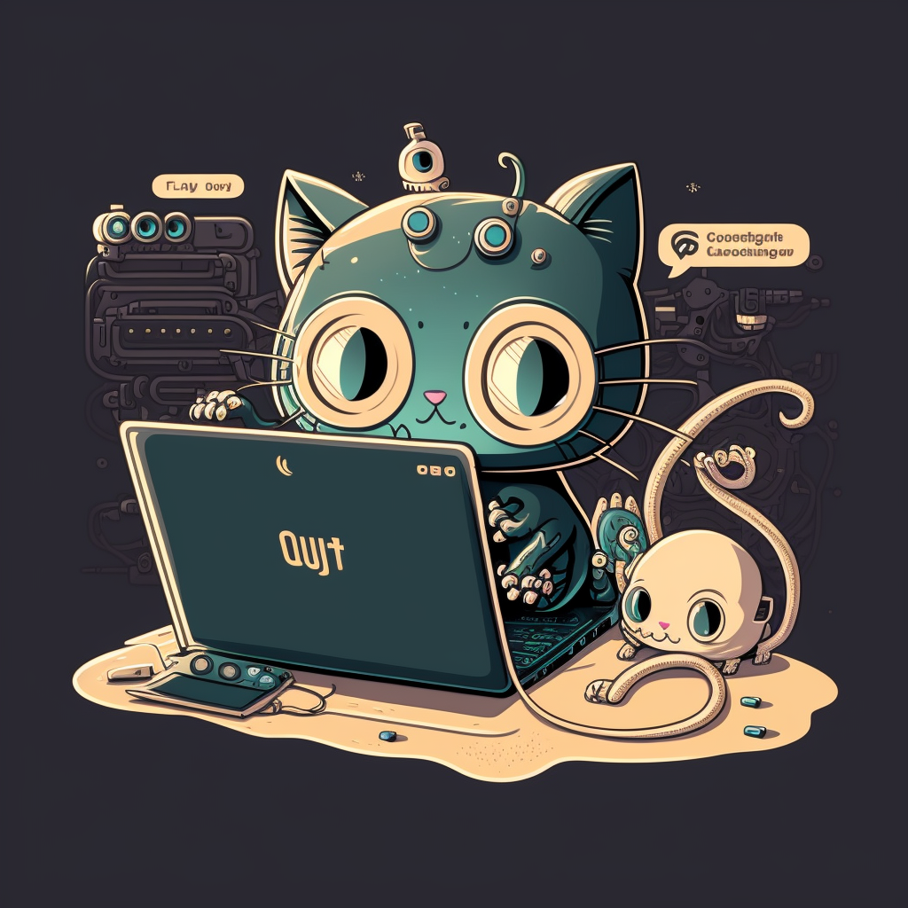

# Blog Personal de Erick

Blog desarrollado con la intención de compartir lo que he aprendido a lo largo de mi trayectoria como Robotics Software Engineer.

Subiré contenido relacionado a Neovim, ROS 2, Python, C++, Rust y Machine Learning.

